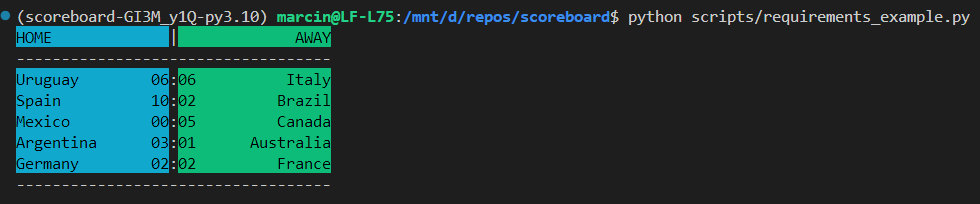
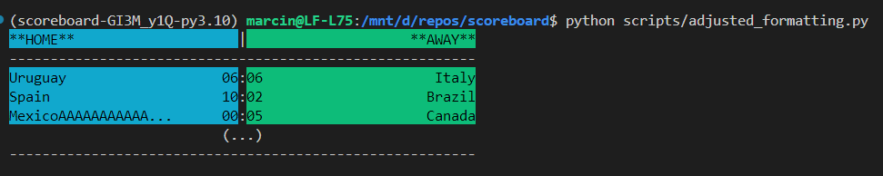

# Installation

### Local poetry environment

This is a python project with dependencies managed through poetry. [Install poetry](https://python-poetry.org/docs/#installation) first and in the project directory run:
```bash
poetry install
```
To activate the virual environment, in the project directory, run:
```bash
poetry shell
```
The libary can now be imported:
```python
from scoreboard.scoreboard import Scoreboard

sample_scoreboard = Scoreboard()

sample_scoreboard.start_match("Mexico", "Canada")
sample_scoreboard.start_match("Spain", "Brazil")
sample_scoreboard.start_match("Germany", "France")
sample_scoreboard.start_match("Uruguay", "Italy")
sample_scoreboard.start_match("Argentina", "Australia")

sample_scoreboard.update_match_score("Mexico", "Canada", 0, 5)
sample_scoreboard.update_match_score("Spain", "Brazil", 10, 2)
sample_scoreboard.update_match_score("Germany", "France", 2, 2)
sample_scoreboard.update_match_score("Uruguay", "Italy", 6, 6)
sample_scoreboard.update_match_score("Argentina", "Australia", 3, 1)

print(sample_scoreboard.summary(pretty=True))
```

### Docker

There's a Dockerfile included in the repository. You can build it the usual way (assuming you tag it: `scoreboard:0.1.0`):
```bash
docker build . -t scoreboard:0.1.0
```

By default, the script run on the image is an included example script:
```bash
docker run scoreboard:0.1.0
```
which results in this output:


You can spawn a bash shell on the image and use the library there:
```bash
docker run -it scoreboard:0.1.0 bash
```

# Scripts

### scripts/requirements_example.py

This is the example provided in the requirements. The output is:


### scripts/adjusted_formatting.py 

This is the example provided in the requirements, with output format adjusted in the script. The output is:


# Assumptions:

- Matches can only have non-negative integer scores
- Matches have an upper limit on a number of goals scored. The highest recorder score for a team was about 150 goals, so using 1000 as the top limit seems like a reasonable initial guess. Anything larger than that raises a validation error, as it is almost certainly an input mistake.
- Scoreboard should not allow to start a match for the same team twice. To enforce this, we store not only a list of matches but also a list of individual teams playing. This introduces a bit of redundancy in stored data but allows for quicker and simpler checks.
- Order of teams (home / away) does not matter when querying the scoreboard for a single game. After all, Austria vs Greece is the same as Greece vs Austria in currently played matches, right?
- Despite the requirements specifying that match results should be reported in the "Argentina 3 - Australia 1" format, I decided to output them in a slighly more familiar "Argentina 3:1 Australia" format. This was a conscious decisionand and can be easily reverted if not accepted by the project owner. ;)
- Since, the summary of current matches is returned as a string, there should be an upper limit on the number of lines to ensure readability. We can assume a 20, as it seems to be a lower limit for CLI apps. To retrieve all current matches from the scoreboard, we could implement pagination. For example, `summary(max_lines=20, paginate=True)` could return a list of 20-line strings or `summary(max_lines=20, start_from=60)` for a single 20-line long string starting from the 60th match record. I decided to go with the latter.
- I considered enforcing a rule to prevent lowering the score of an ongoing match but realized it can happen. For example, a referee might invalidate a goal after reviewing VAR. If any form of rule enforcement is to be implemented here, it would require careful consideration.
- I decided to use static class members for customization (display column widths etc). It would be nicer to move them to a config class, but I feel like simple is better here.